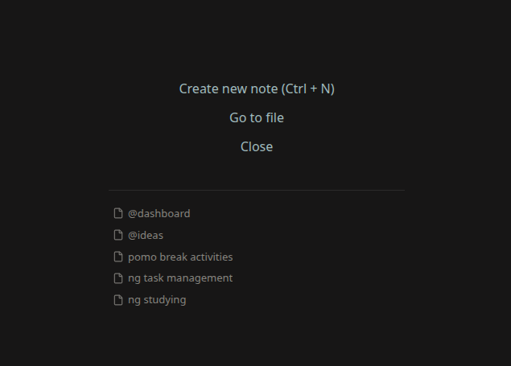

# New Tab Bookmarks

Shows a list of bookmarks in the New Tab view.
Optionally, you can also show some ascii art (as in the screenshot).

  

## Local installation  
Download `new-tab-bookmarks.zip` from the latest release.  
unzip it, such that its contents are in `<your vaullt>/.obsidian/plugins/new-tab-bookmarks`,  
e.g. `<your vaullt>/.obsidian/plugins/new-tab-bookmarks/main.js`  
  
## Developer setup

1. Clone this repo. 
2. Run `pnpm i`. 
3. Create the folder `.obsidian/plugins/new-tab-bookmarks` in your vault.
4. Run `pnpm dev` and `pnpm watcher` in parallel. 
